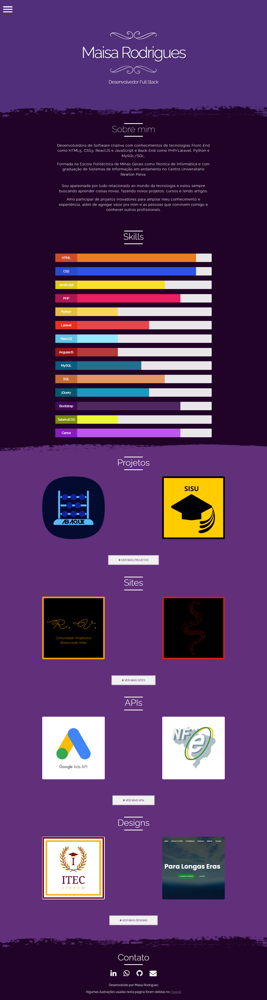

# Portfólio Profissional (Versão Legada) 📂⏳

  

Este repositório contém a versão anterior do meu portfólio profissional. Ele representa um marco importante na minha trajetória, documentando o início da minha carreira e a consolidação das minhas primeiras competências técnicas em desenvolvimento front-end.

## ⚠️ Nota de Evolução
Este projeto está arquivado e é mantido aqui apenas para fins de histórico e demonstração de evolução técnica. 

**Para conferir meu trabalho atual, novas tecnologias e minha marca atualizada, acesse o meu novo portfólio:**
👉 [maisaportfolio.islu.com.br](https://maisaportfolio.islu.com.br/)

## 🛠️ Tecnologias Utilizadas na Época
- **Frontend:** HTML5 e CSS3.
- **Interatividade:** JavaScript.
- **Design:** Focado em layouts institucionais e branding para pequenos negócios.

## 📂 O que este projeto inclui:
- Apresentação inicial de serviços de Web Design.
- Primeiros cases de clientes reais.
- Estrutura de navegação de página única (One Page).

## 🌐 Link do Projeto
A versão online ainda pode ser visualizada aqui: [amaple28.github.io/portfolio_antigo/](https://amaple28.github.io/portfolio_antigo/)

---
Mantido com carinho como parte da minha história no desenvolvimento.
